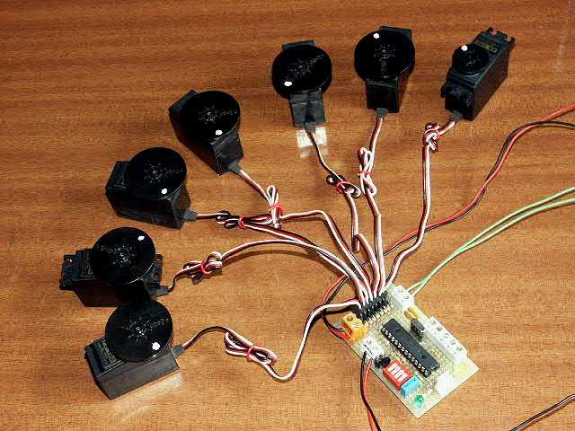

<html>

<head>
<meta http-equiv="Content-Language" content="es">
<meta name="GENERATOR" content="Microsoft FrontPage 4.0">
<meta name="ProgId" content="FrontPage.Editor.Document">
</head>

<table border="0" width="73%">
  <tr>
    <td width="109%"><b><i>Diseño de un módulo para control de
      8 servos y 5 canales analógicos por bus I2C</i></b>
      
Por Alejandro Alonso Puig 
      Octubre 2.003 
     </td>
  </tr>
</table>

 
El presente repositorio incluye no solo los programas y esquemático del circuito en Eagle, 
sino también el informe técnico que describe el diseño, tanto desde el punto de vista
electrónico, como informático de un placa para control por bus I2C
de 8 servos estándar de radiocontrol y 5 entradas analógicas (Conversión
analógica/digital). Las características principales del módulo presentado son
las siguientes:&nbsp;

<ul>
  <li>
    
Actúa como Slave permitiendo seleccionar mediante
    switches dip la dirección que utilizará en la red I2C.&nbsp;</li>
  <li>
    
Se puede establecer mediante bus I2C tanto la
    posición deseada de cada servo, como el sentido de giro y el Offset.&nbsp;</li>
  <li>
    
Se puede leer por bus I2C el valor digital (8
    bits) correspondiente a cualquiera de las 5 entradas analógicas de las que
    dispone.&nbsp;</li>
</ul>

&nbsp;

La ventaja que se obtiene con este tipo de módulos es
precisamente el control por bus I2C que permite tener varios módulos
de este tipo ventaja que se obtiene con este tipo de módulos es precisamente el
control por bus I2C que permite tener varios módulos de este tipo
conectados al mismo bus. De esta manera pueden controlarse gran cantidad de
servos desde un controlador principal sin apenas sobrecarga en el mismo.
Adicionalmente se tiene medida de valores analógicos, muy útil para
determinado tipo de sensores.

<b>Nota</b>: Master y Slave han de estar conectados mediante tres hilos:
Masa, SCL y SDA. El módulo presentado incluye las resistencias de PullUp, por
lo que no es necesario añadirlas.

